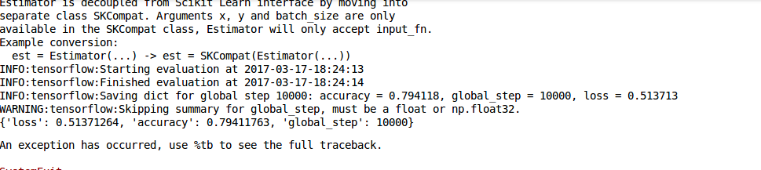

## Image Classification of Buildings (Binary Classification)

### Objective

The objective of this project is to use a convolutional neural network to identify objects in a image from Google maps. The objective is to classify different objects like Building, Road, Trees etc.

This will be useful to create shape files of locations. This project can be further developed to pass the image of a location which has many objects and the network can be trained to identify various kinds of objects and create .shp files from them

### Steps involved

* Reading an image
* Converting it to the required size
* Passing the image through a convolutional neural network to determine accruacy with which the building is identified

### READING THE IMAGE

* The images are classified into testing and training data sets which are used to train the model
* These images are named as Buildings if the image has a building object
* The images are saved in a numpy array
* There are two numpy arrays. One that contains the image and the other contains the label associated with the image ('Building' is given a value 1 and 'Not a building' as 0)

### CONVERTING IMAGE TO THE REQUIRED SIZE

* The opencv package is used to read and convert the image to the required size so that it can be fed to the neural network
* In our case the image is converted to 128x128x3

### CONVOLUTIONAL NEURAL NETWORK

* Framework Adpoted : TensorFlow
* GPU : AWS Bitfusion Ubuntu 14 TensorFlow

### Steps:


* The image that has been converted to the desired size is fed to the convolutional neural network

#### Convolutional and Pooling Layers

* Input Layer - Dimensions - (252, 128, 128, 3)
* Convolutional Layer 1 - (252, 128, 128, 32)
* Max Pooling 1 - (252, 64, 64, 32)
* Convolutional Layer 2 - (252, 64, 64, 16)
* Max pooling 2 - (252, 32, 32, 16)
* Convolutional Layer 3 - (252, 128, 128, 4)
* Max Pooling 3 - (252, 64, 64, 4)


* Once the convolutional layers are applied, the output is flattened and dense layers are applied

* Flattening - (252, 16384)


### Dense layers are applied
* Dense Layer 1 - (252, 256)
* Dense Layer 2 - (252, 32)
* Dense Layer 3 - (252, 16)
* Dense Layer 4 - (252, 8)
* Dense Layer 5 - (252, 4)
* Dense Layer 6 - (252, 2)

## Accuracy



Accuracy achieved is <b>79.4%


```python

```
